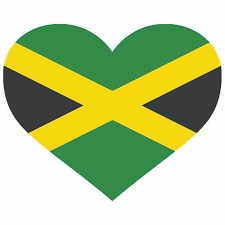

Emphasis, use of *asterisks* or _ underscores _.
This text will be italic.

*Trust is like a sticker*.
_Once it is removed,it may stick again,but not as strong as it holds when you first applied it_.

Strong emphasis, use of **asterisks** or __ underscores__.
This text will be bold.

**Life has taught me that you cannot control someones loyalty**.
__Our destiny is not created by the shoes we wear__.

Combined emphasis, with **asterisks and _underscores_**.

**Complimentary colours have high contrast,which produce vibrant exciting colour schemes_**.

Strikethrough uses two tildes,~~Scratch this.~~ 

~~The beauty of life does not depend on how happy you are but on how happy others can be because of you~~

Lists;
Unordered 

*Adobe
  *Adobe illustrator
  -Adobe photoshop
  +Adobe premiere 
  
Ordered 

1.Let them judge you.
2.Let them misunderstand you.
3.Let them gossip about you.

Images 

  

